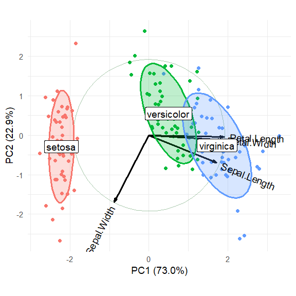

<!-- README.md is generated from README.Rmd. Please edit that file -->
<!-- badges: start -->

[](https://CRAN.R-project.org/package=ggbiplot)
[](https://github.com/friendly/ggbiplot)
<!-- badges: end -->

This repo for the [ggbiplot
package](https://CRAN.R-project.org/package=ggbiplot) was forked from
<https://github.com/vqv/ggbiplot> by Vince Yu, which has been dormant
since 2015.

The goal is to complete that development and publish a new version on
CRAN. There is also an [experimental
branch](https://github.com/friendly/ggbiplot/tree/experimental) which
attempts to simplify the code, but this has some unresolved problems.

# ggbiplot 

An implementation of the biplot using `ggplot2`. The package provides
two functions: `ggscreeplot()` and `ggbiplot()`. `ggbiplot` aims to be a
drop-in replacement for the built-in R function `biplot.princomp()` with
extended functionality for labeling groups, drawing a correlation
circle, and adding Normal probability ellipsoids.

## Installation

Install the current master branch with:

``` r
remotes::install_github("friendly/ggbiplot")
```

## Example Usage

### Wine data

The `wine` data contains results of a chemical analysis of wines grown
in the same region in Italy, derived from three different cultivars. The
analysis determined the quantities of 13 chemical constituents found in
each of the three types of wines. The grape varieties (cultivars),
**barolo**, **barbera**, and **grignolino**, are given in `wine.class`.

What can we understand about the differences among these wines from a
biplot?

``` r
library(ggbiplot)
library(ggplot2)
library(dplyr)

data(wine)
wine.pca <- prcomp(wine, scale. = TRUE)
ggscreeplot(wine.pca) +
  theme_bw(base_size = 14)
```

<!-- -->

Hmm. The screeplot shows that more than two dimensions are necessary to
account for most of the variance.

Plot the first two PCA dimensions, accounting for 55% of the variance.

``` r
ggbiplot(wine.pca, 
  obs.scale = 1, var.scale = 1,
  groups = wine.class, 
  ellipse = TRUE, 
  circle = TRUE) +
  labs(fill = "Cultivar", color = "Cultivar") +
  theme(legend.direction = 'horizontal', legend.position = 'top')
```

<!-- -->

The three cultivars are arranged along the first dimension, in the order
barolo \< grignolino \< barbera. These are distinguished largely by a
conrtast between (`Phenols`, `Flav`) vs. (`NonFlavPhenols`, `AlcAsh`).
The second dimension is represented by the cluster of variables `Mg`,
`Alcohol`, `Ash`, `Color`, which distinguishes grignolino from the other
two.

### Iris data

``` r
data(iris)
iris.pca <- prcomp (~ Sepal.Length + Sepal.Width + Petal.Length + Petal.Width,
                    data=iris,
                    scale. = TRUE)
summary(iris.pca)
#> Importance of components:
#>                           PC1    PC2     PC3     PC4
#> Standard deviation     1.7084 0.9560 0.38309 0.14393
#> Proportion of Variance 0.7296 0.2285 0.03669 0.00518
#> Cumulative Proportion  0.7296 0.9581 0.99482 1.00000
```

Plot the first two dimensions:

``` r
iris.gg <-
ggbiplot(iris.pca, obs.scale = 1, var.scale = 1,
         groups = iris$Species, point.size=2,
         varname.size = 5, 
         varname.color = "black",
         varname.adjust = 1.2,
         ellipse = TRUE, 
         circle = TRUE) +
  labs(fill = "Species", color = "Species") +
  theme_minimal(base_size = 14) +
  theme(legend.direction = 'horizontal', legend.position = 'top')

iris.gg
```

<!-- -->

It is possible to add annotations to the biplot by making use of the
fact that `ggplot()` returns a lot of information in the `"gg"` object.
In particular, the `$data` component contains the scores on the
principal components that are plotted as points here. Here we add direct
labels for the groups and suppress the legend.

``` r
# get means of coordinates by group
group.labs <-
  iris.gg$data |>
  summarise(xvar = mean(xvar),
            yvar = mean(yvar), .by = groups)

group.labs
#>       groups       xvar       yvar
#> 1     setosa -2.2173249 -0.2879627
#> 2 versicolor  0.4947904  0.5483335
#> 3  virginica  1.7225345 -0.2603708
```

Now, just use `geom_label` to draw labels for the groups.

``` r
iris.gg + geom_label(data = group.labs,
                     aes(x = xvar, y=yvar, label=groups),
                     size = 5) +
  theme(legend.position = "none")
```

<!-- -->
